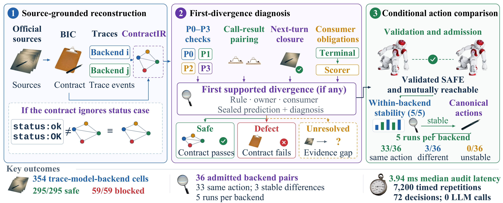

# ParityMem

**Compatibility before action comparison for structured LLM inference.**

[中文说明](README_zh.md) · [Quick start](docs/QUICKSTART.md) · [Evidence map](docs/EVIDENCE.md) · [Paper](paper/main.pdf)

ParityMem checks whether structured interaction records satisfy source-owned consumer obligations. It preserves permitted representation changes, identifies the first supported consumer violation, and separates interface admission from stable canonical-action comparison.



Figure assets retain their [photo credits and licenses](paper/PHOTO_CREDITS.md).

## Run locally

Python 3.10+; the default commands use only the standard library. No package installation, model weights, API keys, GPU, benchmark server or network connection is needed.

```bash
python3 -B tools/artifact.py verify
python3 -B tools/artifact.py demo --output outputs/demo
```

`verify` checks every packaged file hash and reads the existing matrix, adapter, action and timing records. It executes no predictor. `demo` runs the frozen symbolic checker on four existing controlled fixtures: permitted representation drift, expected official behavior, a semantic defect and a closure/execution defect. It compares its decisions with the recorded predictions and writes to a new output directory. Existing outputs are never overwritten.

The controlled checker consumes recorded normative/observed semantics, pairing and consumer evidence. This demonstration is a code smoke check over existing inputs, not a new model experiment or a new pre-consumer prediction study.

## What the frozen evidence shows

| Study | Unit | Recorded result |
|---|---|---|
| Original compatibility matrix | 354 trace–model–backend cells | All 295 safe cells accepted; all 59 blocked cells detected |
| Adapter/contract reuse | 144 primary trace–contract conditions | 144/144 verdict, consequence and first-divergence agreement |
| Conditional action comparison | 36 admitted backend pairs, five calls per backend condition | 33 stable agreements; 3 stable action differences |
| Recurring symbolic audit cost | 7,200 timed repetitions over 72 decisions | 3.94 ms recorded median latency |

These denominators measure different objects and are not added together. The action study uses SGLang 0.5.6.post2 and vLLM 0.23.0. See [Evidence and scope](docs/EVIDENCE.md) for the 300-case holdout, its 120-case novel subset, the 60-case programmatic adjudication, mechanism probes and execution-specific results.

## Repository layout

```text
tools/artifact.py                  Offline verification and bounded demo
reproducibility/full_core/         Frozen checker, typed IR, pairing logic and inputs
reproducibility/frozen_evidence/   Matrix predictions and official outcomes
reproducibility/extension_experiments/contract_test/
                                  Adapter, contracts and existing validation records
reproducibility/action_comparison/ Five-repeat canonical actions
reproducibility/runtime_binding/  Portable public runtime view and sample/request identities
reproducibility/adjudication/      Independent program and original recorded judgments
reproducibility/timing_records/    Original timing observations and measurement definitions
recorded_outputs/                 Historical receipts, preserved as records
paper/                            v7 manuscript source, PDF and all figure formats
docs/                             Usage, evidence scope, source terms and publishing guide
```

## Reuse the code

The original controlled predictor is `reproducibility/full_core/runner.py`; its typed representations and checks live under `reproducibility/full_core/vendor/paritymem/`. The recorded-input schema and exact function boundaries are described in [Code and inputs](docs/CODE_AND_INPUTS.md). Source-specific matrix rules and controlled adapter experiments retain separate interfaces and study scopes.

The original source snapshots and results are bound by [SOURCE_PROVENANCE.json](SOURCE_PROVENANCE.json). New public runtime/continuation views select fields from original records and identify their source hashes; they are explicitly labeled as views. Server logs, per-process resource inventories and author administration files stay in the local v7 review package.

## Paper and release status

The supplied PDF is a manuscript snapshot prepared for ICASSP 2027, with author placeholders still awaiting the authors' details. No acceptance or publication status is implied. This repository is currently a **local release candidate**; no public URL is claimed. Author/citation metadata and a project-wide code license have not yet been supplied. Original third-party notices and [source terms](docs/SOURCE_TERMS.md) remain in effect; this candidate does not assign a new license to those materials.
